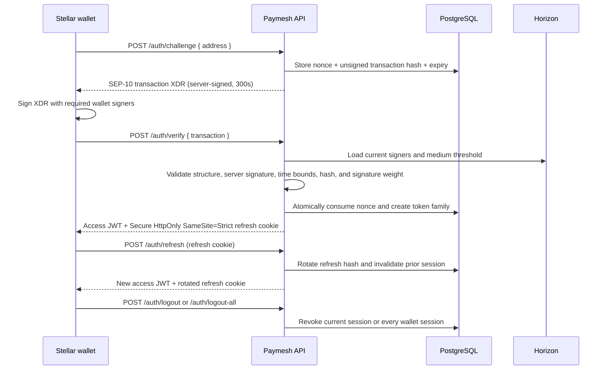

# PaymeshStellar Backend

Express.js backend for the PaymeshStellar application.

## Project Structure

```
backend/
├── src/
│   ├── __tests__/        # Smoke tests (health, CORS, headers)
│   ├── middleware/        # Auth middleware
│   ├── routes/            # Express route handlers
│   │   └── __tests__/    # Route integration tests
│   ├── services/          # Business logic and PostgreSQL auth stores
│   ├── types/             # Shared domain types (Group, GroupMember, …)
│   ├── utils/             # Shared utilities (jwt, stellar, validation)
│   ├── db/                # PostgreSQL pool, schema, and migrations
│   ├── errors/            # Custom error classes (future)
│   └── index.ts           # App entry point
├── dist/                  # Compiled JavaScript (generated)
├── package.json
├── tsconfig.json
├── .eslintrc.json
├── .prettierrc
└── .env.example
```

## API Endpoints

### `GET /health`

Returns server liveness information.

```json
{
  "status": "ok",
  "uptime": 42,
  "version": "0.1.0"
}
```

- `status` — always `"ok"` when the server is running
- `uptime` — seconds since the process started
- `version` — value from `package.json`

### `GET /`

Returns a welcome message confirming the API is reachable.

## Security

- `helmet` sets standard HTTP security headers on every response
- `cors` restricts `Access-Control-Allow-Origin` to `CORS_ORIGIN` (required in production)
- Request bodies are limited to `50kb`
- Wallet authentication uses standard SEP-10 challenge transaction XDR
- Access JWTs expire after 15 minutes by default and are tied to revocable sessions
- Refresh tokens are stored only as SHA-256 hashes and rotate after every use
- Reusing a rotated refresh token revokes its entire family and records a security event
- Nonce, transaction-hash, and refresh-token comparisons are timing-safe

## Wallet authentication and sessions

Run `npm run db:migrate` after deploying this version. Migration `002_auth_sessions_up.sql`
adds persistent challenges, hashed refresh sessions, expiry indexes, and security events.



`POST /auth/challenge` returns `data.transaction` (also aliased as `data.xdr`) and
the network passphrase. The transaction has sequence zero, a first manage-data
operation named `<STELLAR_HOME_DOMAIN> auth` whose value is a 48-byte random nonce
encoded as base64, a `web_auth_domain` operation, 300-second time bounds by default,
and the server signature.

Submit the wallet-signed envelope as `{ "transaction": "...base64 XDR..." }` to
`POST /auth/verify`. On success, `data.accessToken` is returned in the body (the
existing `data.token` alias remains available), while `paymesh_refresh` is set only
as a `Secure; HttpOnly; SameSite=Strict` cookie. `POST /auth/refresh` rotates that
cookie. `POST /auth/logout` revokes the current refresh session; authenticated
`POST /auth/logout-all` revokes every session for `req.user.publicKey`. Protected
requests validate the JWT session id, so revocation takes effect immediately.

### Authentication environment variables

| Variable                        | Required/default                                | Purpose                                                          |
| ------------------------------- | ----------------------------------------------- | ---------------------------------------------------------------- |
| `JWT_SECRET`                    | Required outside tests; at least 32 UTF-8 bytes | HS256 access-token key. Startup fails if missing or short.       |
| `ACCESS_TOKEN_TTL_SECONDS`      | `900`                                           | Access JWT lifetime.                                             |
| `REFRESH_TOKEN_TTL_SECONDS`     | `2592000`                                       | Refresh-session lifetime.                                        |
| `CHALLENGE_TTL_SECONDS`         | `300`                                           | SEP-10 transaction time-bound lifetime.                          |
| `AUTH_CLEANUP_INTERVAL_SECONDS` | `3600`                                          | Frequency of expired auth-row cleanup.                           |
| `STELLAR_SIGNING_SECRET`        | Required outside tests                          | Secret seed used only to sign SEP-10 challenges.                 |
| `STELLAR_HOME_DOMAIN`           | `localhost`                                     | SEP-10 home domain and `<domain> auth` operation prefix.         |
| `STELLAR_WEB_AUTH_DOMAIN`       | `localhost`                                     | Expected `web_auth_domain` operation value.                      |
| `STELLAR_NETWORK`               | Stellar testnet passphrase                      | Network passphrase used to build and verify XDR.                 |
| `HORIZON_URL`                   | Stellar testnet Horizon                         | Loads current signer weights and medium threshold.               |
| `DATABASE_URL`                  | Required for non-test auth                      | PostgreSQL connection used for challenges, sessions, and events. |
| `SOROBAN_RPC_URL`               | Required outside tests                          | Soroban RPC endpoint (e.g. Testnet RPC).                         |
| `SOROBAN_NETWORK_PASSPHRASE`    | Required outside tests                          | Passphrase for the Soroban network (e.g. Testnet passphrase).    |
| `AUTOSHARE_CONTRACT_ID`         | Required outside tests                          | Contract ID for the deployed AutoShare smart contract.           |

The refresh cookie requires HTTPS. `SameSite=Strict` also means the frontend and
API should be deployed as the same site (they may use different subdomains).

## Smart Contract Integration (AutoShare)

The backend provides a proxy and transaction assembly service for the AutoShare Soroban contract via `POST /api/contract/groups/:id/distribute/prepare` and `POST /api/contract/tx/submit`.
The backend NEVER signs a transaction for a user; the workflow expects client-side signatures:

1. Client calls `prepare` endpoint.
2. Server validates authorization, calls `simulateTransaction` on the RPC to gather footprint and resource usage, and constructs an unsigned assembled `Transaction` with an automatically boosted resource fee (x1.2 by default).
3. Server returns the serialized XDR back to the client.
4. Client signs the XDR with their Stellar wallet.
5. Client sends the signed XDR to the `submit` endpoint.
6. Server sends the signed XDR to the RPC endpoint and uses exponential backoff polling to verify successful execution, throwing specific strongly-typed mapped errors if execution fails on-chain.

## Getting Started

### Prerequisites

- Node.js 18.x or higher
- pnpm 8.x or higher

### Installation

```bash
# Install dependencies from root
pnpm install

# Set up environment variables
cp backend/.env.example backend/.env
```

### Development

```bash
# Start development server with hot reload
pnpm backend:dev
```

The server will start at `http://localhost:3001`.

### Build

```bash
# Compile TypeScript to JavaScript
pnpm backend:build

# Start production server
pnpm --filter backend start
```

## Code Quality

### Linting

```bash
# Check for linting errors
pnpm backend:lint

# Fix linting errors automatically
pnpm --filter backend lint:fix
```

### Formatting

```bash
# Format code
pnpm backend:format

# Check if code is formatted
pnpm --filter backend format:check
```

### Type Checking

```bash
# Check TypeScript types
pnpm --filter backend type-check
```

## Planned Services

- **API Server** - RESTful or GraphQL API to serve the frontend and interact with the blockchain
- **Database Integration** - Data persistence layer for off-chain data (user profiles, transaction history, caching)
- **Authentication** - User authentication and authorization (wallet-based auth, session management, JWT tokens)
- **Webhook Handlers** - Listeners for blockchain events and external service callbacks

## CI/CD

This backend is automatically tested and built through GitHub Actions. See `.github/workflows/backend.yml` for the workflow configuration.

The workflow runs on:

- Push to `main` or `develop` branches
- Pull requests to `main` or `develop` branches
- Only when backend-related files change

Check includes:

- Dependencies installation
- TypeScript type checking
- ESLint linting
- Prettier formatting check
- Production build

## Technologies

- **Framework**: Express.js
- **Language**: TypeScript
- **Linter**: ESLint
- **Formatter**: Prettier
- **Runtime**: Node.js
